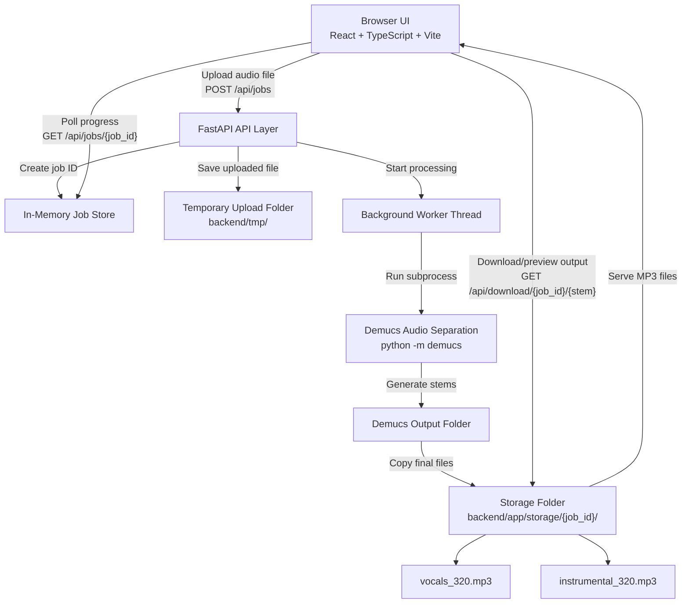

# Vocalify

Vocalify is a full-stack web app for creating karaoke-ready instrumental tracks from uploaded songs. It lets a user upload an audio file, separates the vocals from the backing track with Demucs, and returns downloadable 320 kbps MP3 files for both vocals and instrumental audio.

The project was built around a practical problem: free online vocal removers often produce low-quality results, while higher-quality tools are usually paid. Vocalify wraps a Python audio-separation workflow in a simple web interface so singers can generate practice tracks from their own audio files.

## Features

- Upload common audio formats such as MP3, WAV, M4A, and FLAC.
- Run high-quality vocal separation with Demucs.
- Generate two output files:
  - `vocals_320.mp3`
  - `instrumental_320.mp3`
- Track job progress from the frontend while separation runs on the backend.
- Preview separated stems in the browser with native audio controls.
- Download the final MP3 outputs.
- Docker-ready backend deployment.

## Tech Stack

### Frontend

- React 19
- TypeScript
- Vite
- Tailwind CSS
- ESLint

### Backend

- Python 3.12
- FastAPI
- Uvicorn
- Demucs
- PyTorch
- Torchaudio
- ffmpeg

### Runtime Model

- Frontend runs as a static Vite app.
- Backend runs as a FastAPI service.
- Demucs runs as a Python subprocess.
- Job progress is stored in memory for the current backend process.
- Output files are written to backend storage and served through download routes.

## Repository Structure

```text
Vocalify/
  README.md
  .gitignore

  backend/
    Dockerfile
    requirements.txt
    .vscode/
      settings.json
    app/
      __init__.py
      main.py
      jobs.py
      services/
        __init__.py
        demucs_runner.py

  frontend/
    package.json
    package-lock.json
    vite.config.ts
    tailwind.config.js
    postcss.config.js
    eslint.config.js
    tsconfig.json
    tsconfig.app.json
    tsconfig.node.json
    .env.production
    index.html
    public/
      logo.jpg
      vite.svg
    src/
      main.tsx
      App.tsx
      index.css
      App.css
      api/
        client.ts
      assets/
        react.svg
```

## Architecture Diagram




### Frontend Responsibilities

The frontend lives in `frontend/` and is responsible for:

- collecting the audio file from the user
- sending uploads to the backend
- polling job status
- rendering progress, errors, and final output cards
- previewing and downloading generated MP3 files

Important files:

- `frontend/src/App.tsx` contains the main UI and polling flow.
- `frontend/src/api/client.ts` contains the API client functions.
- `frontend/src/index.css` loads Tailwind styles.

### Backend Responsibilities

The backend lives in `backend/` and is responsible for:

- receiving uploaded audio files
- creating job IDs
- tracking job state
- running Demucs
- copying final separated stems into stable output filenames
- serving generated MP3 files

Important files:

- `backend/app/main.py` defines the FastAPI app, API routes, CORS, upload handling, worker startup, and download endpoints.
- `backend/app/jobs.py` defines the in-memory job status store.
- `backend/app/services/demucs_runner.py` wraps the Demucs command and parses progress from subprocess output.

## Backend API Routes

Base URL in local development:

```text
http://localhost:8000
```

### Start Separation Job

```http
POST /api/jobs
```

Starts a new audio separation job.

Request type:

```text
multipart/form-data
```

Form fields:

| Field | Type | Required | Description |
| --- | --- | --- | --- |
| `file` | File | Yes | Audio file to separate. |

Example with curl:

```bash
curl -X POST http://localhost:8000/api/jobs \
  -F "file=@song.mp3"
```

Successful response:

```json
{
  "jobId": "abc12345",
  "statusUrl": "/api/jobs/abc12345",
  "vocalsUrl": "/api/download/abc12345/vocals",
  "instrumentalUrl": "/api/download/abc12345/instrumental"
}
```

### Get Job Status

```http
GET /api/jobs/{job_id}
```

Returns the current state of a separation job.

Example:

```bash
curl http://localhost:8000/api/jobs/abc12345
```

Response shape:

```json
{
  "job_id": "abc12345",
  "state": "running",
  "stage": "separating",
  "progress": 42.0,
  "message": "Processing...",
  "eta_seconds": 35,
  "error": null
}
```

Possible `state` values:

| State | Meaning |
| --- | --- |
| `queued` | Job was created and is waiting to start. |
| `running` | Audio separation is currently running. |
| `done` | Separation completed successfully. |
| `error` | Separation failed. |

Common `stage` values:

| Stage | Meaning |
| --- | --- |
| `starting` | Worker and Demucs process are starting. |
| `downloading` | Demucs model files are being downloaded. |
| `separating` | Demucs is separating stems. |
| `finalizing` | Output files are being copied into final names. |
| `done` | Output files are ready. |
| `error` | Processing failed. |

### Download Output Stem

```http
GET /api/download/{job_id}/{stem}
```

Downloads one generated MP3 file.

Path parameters:

| Parameter | Values | Description |
| --- | --- | --- |
| `job_id` | Job ID | ID returned by `POST /api/jobs`. |
| `stem` | `vocals` or `instrumental` | Output stem to download. |

Examples:

```bash
curl -L http://localhost:8000/api/download/abc12345/vocals -o vocals_320.mp3
curl -L http://localhost:8000/api/download/abc12345/instrumental -o instrumental_320.mp3
```

## Local Development Setup

### Prerequisites

Install these before running the project locally:

- Python 3.12
- Node.js 20 or newer
- npm
- ffmpeg
- Git

Demucs uses PyTorch and can be slow on CPU-only machines. The first run may also take longer because Demucs model files may need to download.

### 1. Clone the Repository

```bash
git clone https://github.com/xxkrish/Vocalify.git
cd Vocalify
```

### 2. Install ffmpeg

macOS with Homebrew:

```bash
brew install ffmpeg
```

Ubuntu or Debian:

```bash
sudo apt-get update
sudo apt-get install -y ffmpeg
```

Windows with Chocolatey:

```powershell
choco install ffmpeg
```

After installation, verify ffmpeg is available:

```bash
ffmpeg -version
```

### 3. Set Up the Backend

From the repository root:

```bash
cd backend
python -m venv .venv
```

Activate the virtual environment.

macOS or Linux:

```bash
source .venv/bin/activate
```

Windows PowerShell:

```powershell
.\.venv\Scripts\Activate.ps1
```

Install Python dependencies:

```bash
pip install --upgrade pip
pip install -r requirements.txt
```

Run the backend:

```bash
uvicorn app.main:app --host 0.0.0.0 --port 8000 --reload
```

The backend should now be available at:

```text
http://localhost:8000
```

FastAPI interactive docs are available at:

```text
http://localhost:8000/docs
```

### 4. Set Up the Frontend

Open a second terminal from the repository root:

```bash
cd frontend
npm install
```

Create a local environment file:

```bash
cp .env.production .env.local
```

Edit `.env.local` so local development points to the backend:

```env
VITE_API_BASE=http://localhost:8000
```

Run the frontend:

```bash
npm run dev
```

The frontend should now be available at the URL printed by Vite, usually:

```text
http://localhost:5173
```

## Build Commands

### Frontend Production Build

```bash
cd frontend
npm run build
```

Preview the production build locally:

```bash
npm run preview
```

### Frontend Lint

```bash
cd frontend
npm run lint
```

### Backend Docker Build

```bash
cd backend
docker build -t vocalify-backend .
```

Run the backend container:

```bash
docker run --rm -p 8000:10000 -e PORT=10000 vocalify-backend
```

The containerized backend will be available at:

```text
http://localhost:8000
```

## Environment Variables

### Frontend

| Variable | Required | Example | Description |
| --- | --- | --- | --- |
| `VITE_API_BASE` | Yes | `http://localhost:8000` | Base URL for the FastAPI backend. |

### Backend

| Variable | Required | Default | Description |
| --- | --- | --- | --- |
| `PORT` | No | `10000` in Dockerfile | Port used by the container startup command. |

## Runtime Folders

The backend creates runtime folders automatically:

```text
backend/app/storage/
backend/tmp/
```

These are ignored by Git because they contain generated files:

- uploaded temporary audio files
- Demucs intermediate output
- final vocals and instrumental MP3 files

## Deployment Notes

A common deployment setup is:

- Deploy `backend/` as a Docker web service.
- Deploy `frontend/` as a static site.
- Set `VITE_API_BASE` in the frontend deployment environment to the public backend URL.

For example:

```env
VITE_API_BASE=https://your-vocalify-backend.example.com
```

The backend Dockerfile already installs ffmpeg and starts Uvicorn with the platform-provided `PORT` variable.

## Operational Notes

- Demucs is CPU and memory intensive. Long tracks can take a while on small servers.
- The first separation may be slower if model files need to download.
- Current job state is stored in process memory. If the backend restarts, active job statuses are lost.
- Generated output files are stored on local disk. For production, add a cleanup job or move outputs to object storage.
- For public deployment, add upload size limits and stricter file validation.

## Future Improvements

- Add persistent job storage with SQLite, Postgres, or Redis.
- Move audio processing to a queue worker such as Celery, RQ, or Arq.
- Add upload size, duration, and MIME validation.
- Add automatic cleanup for old generated files.
- Add user-facing error messages for unsupported audio files.
- Add tests for API routes and Demucs runner behavior.
- Replace temporary tunnel URLs with stable deployment URLs.

## License

No license file is currently included. Add a license before distributing or accepting external contributions.
